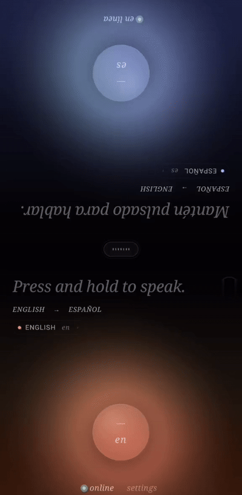
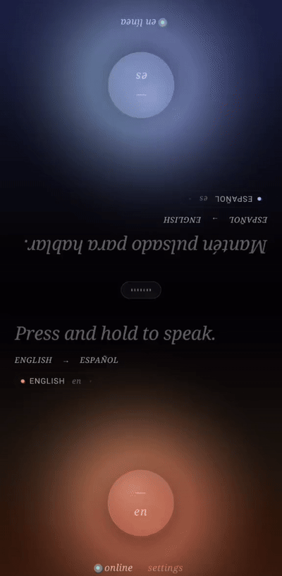

# Parly

**Real-time conversation translator for two people sharing one phone.**

Lay the phone flat on the table. Each half of the screen faces one speaker — rotated so both read upright. One person talks; the other reads the translation as it streams in and hears it spoken aloud moments later. Push-to-talk, or fully hands-free.

<div align="center">
<table>
  <tr>
    <td align="center" width="50%"></td>
    <td align="center" width="50%"></td>
  </tr>
  <tr>
    <td align="center" width="50%"><sub><b>Push-to-talk</b> — hold, speak, release</sub></td>
    <td align="center" width="50%"><sub><b>Hands-free</b> — VAD takes the turns</sub></td>
  </tr>
</table>

<sub><a href="docs/demo-handsfree.mp4">🔊 Watch the hands-free demo with sound</a></sub>
</div>

Built on [Mistral](https://mistral.ai)'s realtime APIs — Voxtral for streaming speech-to-text, chat completions for streaming translation — with the OS's own text-to-speech voices. Bring your own (free) Mistral API key; the app has no backend of its own.

## Features

- **Two-sided by construction** — every piece of UI on each half (status, notices, hints, history) renders in that half's reader's language. 32 languages.
- **Hands-free mode** — on-device voice activity detection (Silero VAD) takes turns automatically: talk, pause, hear the translation, reply. No buttons.
- **Streaming end to end** — transcription, translation and speech all stream; the first translated sentence is spoken while the rest is still arriving.
- **Long turns welcome** — live partial transcripts while you speak, adaptive timeouts, and graceful salvage if the connection hiccups mid-monologue.
- **Scrollable history** — each side can scroll back through the conversation in their own language, then jump back to live.
- **Interruptible** — tap the translation while it's being spoken to skip the readback.
- **Private by design** — no backend, no telemetry, no accounts. The only server the app ever talks to is `api.mistral.ai`, under your own key.

## Languages

English, Spanish, French, German, Italian, Portuguese, Dutch, Russian, Ukrainian, Polish, Czech, Greek, Turkish, Arabic, Hebrew, Persian, Hindi, Bengali, Urdu, Chinese, Japanese, Korean, Vietnamese, Thai, Indonesian, Swedish, Norwegian, Danish, Finnish, Romanian, Hungarian and Swahili — any pair, in either direction.

Spoken output uses the voices installed on the device; if the OS has no voice for a language, Parly shows the text and tells the listener rather than reading it with a wrong-language voice.

## Getting started

### Install the APK (Android 7+, arm64)

Download `app-release.apk` from the [latest release](https://github.com/PabloBR99/parly/releases). On first launch the app walks you through creating a free Mistral API key — three steps, no jargon.

### Build from source

```bash
npm install
npm start          # Metro bundler
npm run android    # in a second terminal, with a device/emulator attached
```

> **Android only for now.** The `ios/` directory is standard React Native scaffolding, but there is no functional iOS build — the audio pipeline has never been wired or tested on iOS. Contributions welcome.

## How it works

```
mic ──► Voxtral realtime (WebSocket) ──► Mistral chat (SSE) ──► OS text-to-speech
         streaming transcription          streaming translation     spoken per sentence
```

A strict half-duplex state machine drives each turn: the microphone and the speaker are never live at the same time, so the phone can't transcribe its own voice. In hands-free mode, on-device VAD detects when you stop talking (600 ms of silence) and dispatches the turn; while the phone speaks, the mic is gated and re-armed clean afterwards. Turn direction is decided from the transcript itself, not just the audio's language tag — which is what keeps same-language misdetections from echo-looping.

The full picture — state machines, echo gating, latency decisions, the UI design language — is in [docs/ARCHITECTURE.md](docs/ARCHITECTURE.md).

## Stack

| | |
|---|---|
| **App** | React Native 0.84 (bare) + TypeScript, Reanimated 4, Zustand 5 |
| **Speech-to-text** | Voxtral realtime over WebSocket (`voxtral-mini-transcribe-realtime-2602`) |
| **Translation** | Mistral chat completions, streaming SSE (`mistral-small-latest`) |
| **Text-to-speech** | `react-native-tts` — OS-native voices |
| **Voice activity detection** | Silero VAD v5 on-device via `onnxruntime-react-native` |
| **Key storage** | `react-native-keychain` (Android Keystore) |

## Development

```bash
npm test           # Jest — 205 tests
npm run lint       # ESLint
npx tsc --noEmit   # typecheck
```

CI builds a release APK and publishes a `dev-<sha>` prerelease on every push to `main`.

## Troubleshooting

- **TTS doesn't speak a language** — the OS has no voice installed for it. Android: *Settings → Accessibility → Text-to-speech → Install voice data*. The app shows the text and tells the listener, rather than reading it with a wrong-language voice.
- **Key won't verify** — regenerate it at [console.mistral.ai/api-keys](https://console.mistral.ai/api-keys) and paste the whole thing. If you're offline, verification retries automatically once you're back.
- **Logs** — Settings → *Diagnostics* → *View logs*. Raw pipeline errors land there; the conversation surface only ever shows plain-language notices.

## Privacy

Parly has no backend. Microphone audio streams directly from your device to Mistral's servers for transcription, and the transcribed text goes to Mistral's chat API for translation — all under **your** API key, governed by [Mistral's terms and privacy policy](https://mistral.ai/terms/). Conversation history lives only in memory on the device and disappears when the session ends. Your API key is kept in the platform secure store and leaves the device only to authenticate against Mistral's API.

## License

[MIT](LICENSE) © 2026 Pablo Bruno Romero
