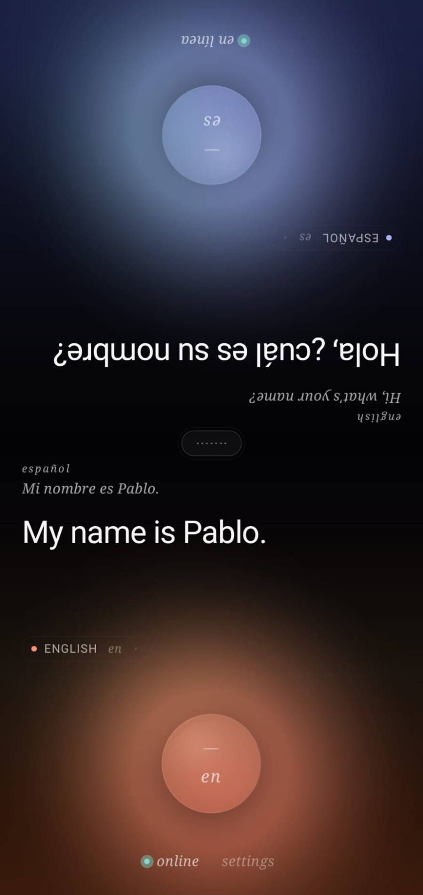

# Parly — Real-Time Conversation Translator

Bidirectional speech translation app. React Native (bare), Android-first. The phone is laid flat between two people; each half of the screen is rotated 180° so both speakers read upright from their side of the table. Half-duplex push-to-talk with streaming STT, streaming translation, and OS-native TTS — every stage starts before the previous one finishes.

Bring your own Mistral API key. The app guides non-technical users through getting one in three plain-language steps the first time they open the app. The conversation surface itself is bilingual by construction: each half renders its chrome — stage microcopy, notices, welcome copy, the network pill — in that half's reader's language (`src/i18n/strings.ts`, 32 languages).

<p align="center">
  
</p>

---

## Quick Start

```bash
npm install
npm start                 # Metro bundler
npm run android           # in another terminal
```

iOS first-time setup:
```bash
cd ios && bundle install && bundle exec pod install && cd ..
npm run ios
```

The app needs a Mistral API key on first run. The in-app onboarding opens [console.mistral.ai/api-keys](https://console.mistral.ai/api-keys) for you, explains how to generate a key, and walks you through pasting and verifying it.

---

## Stack

| Layer | Technology |
|-------|-----------|
| **UI** | React Native 0.84 (bare) + TypeScript, reanimated 4.3, react-native-safe-area-context |
| **State** | Zustand 5 (immutable) |
| **STT** | Voxtral realtime via WebSocket — `wss://api.mistral.ai/v1/audio/transcriptions/realtime` (model: `voxtral-mini-transcribe-realtime-2602`) |
| **Translation** | Mistral chat completions, streaming SSE — `mistral-small-latest` |
| **TTS** | `react-native-tts` (OS-native voices, per-language voice cache) |
| **Audio capture** | `react-native-audio-record` — PCM 16kHz mono, base64-framed |
| **VAD (hands-free)** | Silero VAD v5 via `onnxruntime-react-native` — 512-sample frames @ 16 kHz decide turn-taking on-device |
| **Secret storage** | `react-native-keychain` — API key only, never leaves the device except in `Authorization: Bearer …` |
| **Settings persistence** | Zustand `persist` over a `react-native-fs` file — language pair, model, key status survive restarts (the key itself stays in the keychain) |
| **Tests** | Jest, 147 passing across orchestrator / language routing / Voxtral client / translator / audio capture / network monitor / VAD / app tree |

One on-device ML model ships in the APK: Silero VAD (`android/app/src/main/assets/silero_vad.onnx`, 2.3 MB), which drives hands-free turn detection locally — audio only leaves the device for STT. Everything else stays cloud (STT, translation) or OS-native (TTS). The only egress is `api.mistral.ai`.

**Connectivity:** required during conversations. Connection state shows as a network pill on **both** edges (localized to each reader's language). Failures surface as a plain-language notice on the **speaker's own half**, in the speaker's language — raw error strings go to the log buffer only. Pressing PTT while known-offline answers immediately with the offline notice instead of opening a doomed socket.

---

## Architecture

```
PTT held ──► AudioCaptureService (PCM 16kHz mono, base64 frames)
                    │
                    ▼
              VoxtralRealtimeClient (WebSocket)
                    │  transcription.text.delta  → live partial
                    │  transcription.done        → final
                    ▼
              MistralTranslator (POST /v1/chat/completions, SSE)
                    │  sentence-boundary chunking (regex, min 15 chars)
                    │  per-sentence emit
                    ▼
              NativeTTSService.speakChunk()  ── queued in native engine
                    │  await Promise.all of all chunks
                    │  + 250ms tail silence (Android sink flush)
                    ▼
                turn done — half-duplex lock released
```

The orchestrator owns a strict per-turn state machine:

```
idle ─► recording ─► transcribing ─► translating ─► speaking ─► idle
                                                       │
                                                       └── error ─► idle
```

Every transition is guarded; the lock release is a single bottleneck. Why so strict?

> In a diplomatic demo the worst failure isn't a slow turn — it's a *confused* turn (mic still hot during TTS, two turns interleaved, lock leak preventing the next press from working).

The WebSocket is opened fresh per turn. Idle WS connections are subject to opaque server-side timeouts and mobile network changes; the cost of a fresh connect is ~50–150 ms (TLS session reuse handles the warm path).

---

## UI — Vertical PTT Layout

**Design language:** editorial dark, restrained palette. Two quiet accents — **platinum amber** `#F2B473` for "you" / Person A, **ice blue** `#86BFFF` for "them" / Person B. Depth on true black via translucent halos, never drop shadows.

**Concept:** the phone lies flat between two speakers. Each person's PTT sits at THEIR PHYSICAL EDGE of the device — partner's at the top (rotated 180°), user's at the bottom — so thumbs land naturally. **No center divider line**; the silence between the two source lines IS the seam.

```
┌─────────────────────────────┐
│   ●  en línea               │  ← partner's edge chrome (network pill, partner's language)
│                             │
│           ◯                 │  ← partner's PTT (rotated 180°)
│                             │
│   español  ▾   pensando ◐   │  ← identity chip + state morph + microcopy (partner's language)
│                             │
│   Lo que el usuario         │  ← big translated text — what partner reads
│   acaba de decir            │     (tap to stop it while it's speaking)
│                             │
│   — fuente —                │  ← source line (small, near center)
│                             │
│           (gap)             │  ← PURE SPACE — no divider line
│                             │
│   — source —                │
│                             │
│   What the partner          │
│   just said                 │
│                             │
│   english  ▾   speaking ◉   │  ← identity chip + microcopy (user's language)
│                             │
│           ◯                 │  ← user's PTT
│                             │
│   ●  online      settings   │  ← user's edge chrome (pill on THIS edge too)
└─────────────────────────────┘
```

Each `SpeakerHalf` is rendered top-down in reading order (source → big → identity → button → edge chrome). The top half wraps the whole stack in `transform: rotate(180deg)` so the partner sees everything upright from their side.

**PTTButton — object metaphor:**
- **108 pt disc** surrounded by an asymmetric watercolour bloom (three offset SVG radial gradients, not concentric halos).
- **Idle:** bloom breathes subtly with meditative tempos that feel alive, not anxious.
- **Press:** disc scales by ~5 % (spring); halos brighten.
- **Active:** outer ring breathes outward every 1.6 s, a 5-bar waveform pulses inside the disc (transform-driven — no per-frame layout).
- **Label:** a horizontal mic-affordance tick (16 × 1.5 pt) above the language code at reduced opacity; the endonym lives in the identity chip above. The accessibility label uses the language *name*, never the code.

**Felt rhythm — haptic choreography across the turn:**

| Moment | Pattern |
|--------|--------|
| PTT press | `tap` (single short pulse) |
| `recording → transcribing` | `pulse` (two-step) |
| `transcribing → translating` | `pulse` |
| First spoken token (`translating → speaking`) | `tick` |
| Turn done | `done` (heavier two-step) |
| Turn error | `error` (three-step buzz) |
| Picker row tap | `tick` |

The turn has a felt rhythm that matches its visual rhythm — the user doesn't need to read the screen to know where the machine is.

**Tap-to-interrupt:** while a turn is `translating`/`speaking`, tapping the big translated text cancels it — TTS stops, the lock releases, both discs come back. A half-duplex lock without an abort is an elevator with no door-open button.

**Settling reveal:** incoming text fades AND drifts up 6 px on first appearance, then streams in place — translation deltas render as they arrive (display never waits for a sentence boundary; sentences are the unit for TTS, not for eyes). Driven by a boolean transition (`hasIncomingText`), not by text length — so streaming doesn't re-trigger the entrance and jiggle the line back into place.

**Status microcopy beside `StateMorph`:** listening / thinking / speaking / error — each half in its reader's language (`escuchando` on the Spanish half, `聞いています` on the Japanese half). The glyph alone was ambiguous; the word makes the system audible. The `transcribing` glyph settles the bars to rest (the mic is closed — the glyph must stop claiming capture).

**First-run hint:** the press-and-hold gesture isn't universal, especially for older users expecting a single tap, so a quiet italic "press and hold to speak" (localized per half) sits on each side until the first turn from either side completes — then it disappears for good.

**Notices:** every failure mode has one plain sentence, on the half of the person who can act, in their language: connection dropped, key stopped working, rate limited, "I didn't catch that", mic permission, missing TTS voice, offline. Cancelled turns show nothing — user intent is not an error.

---

## API-Key Onboarding (Mom-Test)

The hard barrier for non-technical users isn't the conversation — it's the API key. The first-run Settings screen replaces every piece of jargon with plain language and a guided three-step flow.

```
Welcome.
Let's get Parly up and running in three steps.

①  Create your Mistral account
   Sign up or log in — it's free and only needs an email address.
   [ Open Mistral  ↗ ]                           ← Linking.openURL

②  Copy your key
   Tap "Create new key". A long code appears —
   long-press it and copy the whole thing.

③  Paste it here
   [_______________________________________]     ← visible, NOT masked:
   Long-press the box and tap Paste.               the user must see the
                                                   paste took the whole key
   [ Verify key ]                                ← primary button

   ✓  All set. You can start talking now.
   [ Start talking  → ]                          ← navigation.goBack()
```

What's *not* there: the strings "Authorization", "sk-", "keychain", "endpoint". When the user already has a working key, this whole flow collapses to a compact **`● Connected to Mistral`** card — and that green state means *validated*, not merely non-empty; an unverified key is checked silently in the background, and a definitively bad one flips the banner and disables the discs.

**Changing the key is non-destructive:** "change key" opens an inline editor; the working key keeps working until a *new* key verifies. There is no single tap anywhere that can strand the user keyless (Mistral's console never re-shows an existing key).

---

## Project Structure

```
parly/
├── src/
│   ├── app/
│   │   ├── languages.ts             # Language metadata (endonym, emoji, scripts)
│   │   └── types.ts                 # PersonId, Language, etc.
│   ├── i18n/
│   │   └── strings.ts               # Per-half surface strings, 32 languages
│   ├── store/
│   │   ├── conversationStore.ts     # Turns, notices, stage transitions
│   │   ├── settingsStore.ts         # PersonA/B language, key status, model id (persisted)
│   │   └── networkStore.ts          # 'unknown' | 'online' | 'offline'
│   ├── services/
│   │   ├── pipeline/
│   │   │   ├── ConversationOrchestrator.ts  # The state machine
│   │   │   ├── errors.ts                    # Raw error → NoticeKey mapping
│   │   │   └── orchestrator.ts              # Singleton DI wiring
│   │   ├── stt/
│   │   │   └── VoxtralRealtimeClient.ts     # WebSocket + frame protocol
│   │   ├── translation/
│   │   │   └── MistralTranslator.ts         # SSE streaming + sentence chunks
│   │   ├── tts/
│   │   │   └── NativeTTSService.ts          # react-native-tts wrapper
│   │   ├── audio/
│   │   │   └── AudioCaptureService.ts       # PCM 16kHz mono base64
│   │   ├── auth/
│   │   │   └── validateApiKey.ts            # GET /v1/models probe
│   │   ├── network/
│   │   │   ├── NetworkMonitor.ts
│   │   │   ├── monitor.ts
│   │   │   └── mistralProbe.ts              # connectivity probe
│   │   ├── storage/
│   │   │   └── secureStorage.ts             # react-native-keychain wrapper
│   │   └── log/
│   │       └── logStore.ts                  # in-memory ring buffer for the Logs screen
│   ├── ui/
│   │   ├── primitives/
│   │   │   ├── PTTButton.tsx                # The hero object
│   │   │   ├── LanguagePickerSheet.tsx      # Reanimated overlay (top or bottom, rotated for partner)
│   │   │   ├── LanguageCard.tsx
│   │   │   ├── SwapButton.tsx
│   │   │   ├── Surface.tsx
│   │   │   ├── Button.tsx
│   │   │   └── Text.tsx
│   │   ├── animations/
│   │   │   ├── Waveform.tsx
│   │   │   ├── Bloom.tsx                    # Watercolour stains (asymmetric, three SVG radial gradients)
│   │   │   └── StateMorph.tsx               # idle/recording/translating/speaking
│   │   ├── theme.ts                         # Diplomatic design tokens
│   │   ├── haptics.ts                       # tap/pulse/tick/done/error
│   │   └── index.ts
│   ├── screens/
│   │   ├── ConversationScreen.tsx           # Main bidirectional surface
│   │   ├── LanguagePairScreen.tsx           # First-run language setup
│   │   ├── SettingsScreen.tsx               # Onboarding + connection status
│   │   └── LogsScreen.tsx                   # Diagnostics
│   └── navigation/
│       └── types.ts
├── android/                                  # Bare RN Android shell
├── ios/                                      # Bare RN iOS shell
├── __tests__/                                # App-level integration test
└── App.tsx
```

---

## Key Design Decisions

1. **Cloud STT + cloud translation, OS-native TTS.** Voxtral handles 30+ languages with quality far above what a phone-bundled whisper-small could deliver, at a fraction of the install footprint. Translation streams sentence-by-sentence via Mistral SSE so TTS starts speaking the first sentence while the second is still arriving from the model. TTS itself is OS-native (zero install, voices already on the device).

2. **Streaming end to end.** Voxtral WS streams partial transcriptions; Mistral SSE streams translation tokens; TTS queues sentences as they boundary-fire. There's no "wait until done" anywhere in the path. The first audible word arrives a beat after the user releases PTT, not after the full translation lands.

3. **Strict half-duplex state machine.** Mic and speaker are never live at the same time. The lock release is the single auditable bottleneck. Hard sequential states make every code path provably terminate and prevent the worst failure mode for a face-to-face translator: an interleaved/confused turn.

4. **Fresh WS per turn.** Idle WebSockets are subject to opaque server-side timeouts (30–90 s observed) and to network-change drops on mobile. Each turn opens a new socket; TLS session reuse keeps subsequent handshakes at ~50–150 ms.

5. **API key in OS keychain.** `react-native-keychain` keeps the key in iOS Keychain / Android Keystore. It only ever appears in the `Authorization: Bearer …` header on requests to `api.mistral.ai`. No telemetry. No analytics.

6. **Vertical PTT axis, no divider, halos for depth.** See UI section. The phone-on-the-table metaphor is the spatial logic for the whole screen.

7. **Mom-tier onboarding.** Every piece of API-key jargon was stripped from the first-run flow. If a non-technical user can get a working key without help, the rest of the conversation UI is already legible (PTT + halos + microcopy + first-run hint).

---

## Recent Shipped Changes

**Language Picker Overlay (`3ef41cd`, `c11602e`):** Replaced native `<Modal animationType="slide">` with an in-screen Reanimated overlay anchored to either edge. Android's Dialog window was producing a visible upward jump on touch no matter the fix; an overlay that only translates (never unmounts) sidesteps the entire native layer. New `side` prop: `'top'` docks to screen-top with 180° rotation for the partner's view, `'bottom'` is the conventional behavior. `ConversationScreen` now renders two pickers (one per slot), each with its own frozen `excludeCode` snapshotted via a render-time ref so the list size never changes mid-animation.

**Bloom redesign (`f7dfd68`):** The HTML mockup uses `filter: blur(30px)` + `mix-blend-mode: screen` — RN can't do either, so a 280 px tight-falloff bloom rendered as a small dim ring on the disc instead of the wide painted wash of the mockup. Three changes: `BLOOM_SIZE` 280 → 480 pt to span the full half of the screen edge-to-edge; stops `0/.18/.42/.72/1` → `0/.22/.50/.80/1` with alpha factors `1/.66/.32/.11/0` → `1/.78/.50/.22/0` so visible alpha carries to ~80 % of radius (the "blur substitute"); peak alphas bumped (warm 0.42/0.38/0.34 → 0.55/0.50/0.45, cool 0.48/0.44/0.40 → 0.62/0.56/0.50) to compensate for missing screen-blend. Stain offsets scaled ~1.7× to keep the painterly asymmetric silhouette in the bigger bloom.

**PTTButton polish (`65a17ce`, `3ef41cd`):** The disc's resting face settled on a mic-affordance tick above the language code at reduced opacity (0.45 in hands-free, 0.62 otherwise), with a neutral hairline border idle and the accent ring + `${accent}26` fill while active. The accessibility label exposes the language *name* for screen readers.

**Settings keyboard handling (`65a17ce`):** Replaced the brittle `scrollToEnd-on-focus` with a `Keyboard.didShow` listener that measures the API-key input's position, computes overlap with the keyboard, and scrolls it ~48 px above the keyboard edge so long-press → Paste is comfortable. Dropped `KeyboardAvoidingView` (Android `adjustResize` handles the heavy lifting). Bumped bottom padding to give the ScrollView room to scroll the input that high. Light Dusk pass on the header (`DuskBackdrop`, peach/periwinkle dot eyebrow, `serifHero` "Welcome." / "Settings.").

**LanguagePair copy + sizing (`79f9a83`):** Headline changed from "Two suns meeting at the edge of the day." to "A live translator for two voices." `LanguageCard` endonym dropped from `displayHuge` (48 px) to `displayLarge` (36 px) — subtle scale-down so the card breathes more.

## Roadmap

| Phase | Status | Highlights |
|-------|--------|-----------|
| **0** — Spike: on-device STT + voice cloning | Discarded | whisper.rn (no Voxtral support) and ZipVoice/sherpa-onnx voice-cloning evaluated; abandoned in favor of cloud STT for quality + footprint. |
| **1–4** — Earlier on-device pipeline | Superseded | See `PLAN.md` for the historical phase log. |
| **v4 pivot** — Voxtral + Mistral + native TTS | ✅ | New orchestrator, streaming end-to-end, half-duplex lock, Mistral key validation. |
| **v5 — UI redesign** | ✅ commit `a43525e` | Vertical PTT axis, bloom disc, editorial restraint, Diplomatic theme. |
| **v5.1 — Picker overhaul + bloom + settings** | ✅ commits `65a17ce` → `f7dfd68` | Reanimated dual-side picker, BLOOM_SIZE 280→480 with softer falloff, accent-tinted PTT, settings keyboard scroll-to-input. |
| **v6 — Polish** | ✅ commit `a34e6e7` | Haptic choreography, status microcopy, settling reveal, first-run hint, mom-tier onboarding. |
| **v7 — Audit fixes** | ✅ (this change set) | Speaker-side localized notices (32 languages), settings persistence, streamed translation display, capture stop/start race fix, release hangover, quick-release flush, no-replay translation fallback, echo gating in hands-free, validate-then-replace key flow, tap-to-interrupt, lazy mic permission, contrast pass, both-edge network pill. |

---

## Troubleshooting

**The "Connect Parly to its brain" banner won't go away after pasting:**  
Tap **Verify key** in Settings. Successful validation flips the banner. If validation reports the key as invalid, regenerate it in [console.mistral.ai/api-keys](https://console.mistral.ai/api-keys). If your phone is offline, the check is retried automatically once you're back online.

**TTS doesn't speak in the target language:**  
The OS has no voice installed for that language. The app shows a one-time notice on the listener's half ("No voice installed for … — showing text only") and deliberately does **not** read the text with a wrong-language voice. On Android, open *Settings → Accessibility → Text-to-speech → Install voice data* and download the language pack.

**Picker animates erratically when you select a language:**  
Fixed in commit `a34e6e7` (frozenExclude snapshot). Pull `main`.

**Metro bundler issues:**
```bash
npm start -- --reset-cache
```

**iOS Pod install fails:**
```bash
cd ios && rm -rf Pods Podfile.lock && bundle exec pod install && cd ..
```

**Logs:** Settings → *Diagnostics* → *View logs* (only visible after a key is configured). Raw pipeline errors land here; the conversation surface only ever shows the humanized notices.

---

## References

- **Mistral Voxtral (audio realtime):** https://docs.mistral.ai/api/#tag/audio/operation/audio_transcriptions_realtime_v1_audio_transcriptions_realtime_get
- **Mistral chat completions (translation backbone):** https://docs.mistral.ai/api/#tag/chat
- **react-native-tts:** https://github.com/ak1394/react-native-tts
- **react-native-keychain:** https://github.com/oblador/react-native-keychain
- **Reanimated:** https://docs.swmansion.com/react-native-reanimated/
- **React Native:** https://reactnative.dev
